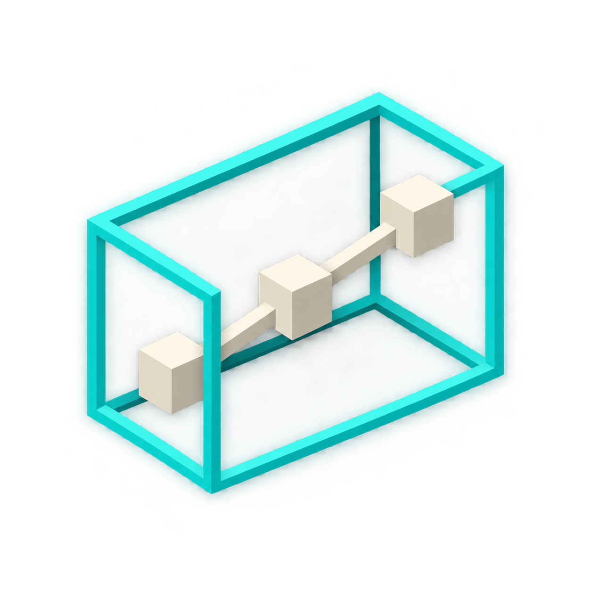

# BoneHitboxLib

<p align="center"></p>

[English](README.md) | [简体中文](README.zh-CN.md)

从模型几何生成有向包围盒（OBB）的 Minecraft 库，提供部位选择、战斗与碰撞事件、逐部位状态、模型方块形状，以及可选的 GeckoLib 关键帧技能。

## 支持版本

| Minecraft | 库版本 | 加载器 | Java | 源码工程 |
| --- | --- | --- | --- | --- |
| 26.2 | 0.2.1 | Fabric / NeoForge | 25 | 仓库根目录 |
| 26.1.2 | 0.2.0 | Fabric / NeoForge | 25 | [26.1.2](versions/BoneHitboxLib-26.1.2) |
| 1.21.1 | 0.2.0 | Fabric / NeoForge | 21 | [1.21.1](versions/BoneHitboxLib-1.21.1) |
| 1.20.1 | 0.2.0 | Fabric / Forge | 17 | [1.20.1](versions/BoneHitboxLib-1.20.1) |

每个版本都是独立 Gradle 工程。客户端与服务端应使用匹配的 Minecraft、加载器和库构建。0.2.1 当前只适用于 26.2。

## 主要功能

- **实体模型几何**：采集动画后的原版 `ModelPart` cube 和可选 GeckoLib cube。实体通过 `BoneHitboxEntity` 显式接入；`ALL`、`BASE`、`HUMAN_BASE` 等选择器选取实际模型部位。
- **部位选择与战斗**：射线选择、轮廓高亮，可修改的 `ATTACK`、`HURT`、`COLLISION` 属性，接触事件，以及生命值等逐部位数据。
- **碰撞与承载**：支持 `NONE`、`SOFT`、`HARD` 策略、连续 OBB 碰撞处理和实体承载。手持物几何跟随物品范围与手臂、模型变换。
- **服务端查询与同步**：`ObbServerGeometry` 提供近期模型姿态快照，包含变换、主轴、半尺寸和顶点；状态与扩展数据可同步和持久化。
- **GeckoLib 关键帧技能**：支持单点 marker 与 `BEGIN/TICK/END/CANCEL` 窗口，在视锥外推进已追踪实体的时间轴，并在服务端去重上报。
- **模型方块**：可选 OBB 或 AABB，由模型元素推导占位格，联动处理多格结构的放置、拆除与交互。

## 安装

选择匹配 Minecraft 版本和加载器的 JAR，放入需要此库的客户端与服务端 `mods/` 目录。Fabric 还需要匹配的 Fabric API 和 Forge Config API Port。GeckoLib 为可选依赖；使用 GeckoLib 模型或关键帧技能时安装对应版本。

锁定依赖见[版本指南](versions/README.zh-CN.md)。构建对应加载器工程可得到安装包。`-sources.jar`、`-javadoc.jar` 是开发资料，不是可安装模组。

## 实体接入

实现 `BoneHitboxEntity` 并注册参与处理的部位，例如：

```java
@Override
public void bonehitboxlib$registerObbBones(ObbBoneRegistrar registrar) {
    registrar.register(ObbBoneRegistrar.ALL)
            .collision(ObbCollisionMode.HARD)
            .dataFactory(
                    ObbBoneRegistrar.BASE,
                    ObbBuiltinDataKeys.PART_HEALTH,
                    () -> new ObbPartHealth(20.0F, 20.0F))
            .data(ObbBuiltinDataKeys.CARRIES_ENTITIES, true);
    registrar.register("right_arm").attack();
}
```

请使用模型中真实的骨骼名称。`dataFactory(BASE, ...)` 选择当前注册中的基础部位；`data(...)` 作用于所有选中部位。内置玩家接入使用包含基础部位和手持物的 `HUMAN_BASE`。导入、事件和状态管理见[注册与同步 API](docs/server_sync_api.md)。

## 方块几何配置

编辑加载器生成的服务端配置 `bonehitboxlib-server.toml`：

```toml
vanillaSlantedBlockObb = true
forceAllBlockObb = false
blockModelWhitelist = []
blockModelBlacklist = []
```

- `vanillaSlantedBlockObb`：原版斜面方块使用已打包的模型几何，默认开启。
- `forceAllBlockObb`：为允许范围内的所有方块启用 OBB 碰撞，默认关闭。优先使用已打包模型元素，缺失时使用方块自身的有限碰撞几何；原本为空的碰撞保持为空。
- `blockModelWhitelist`：空列表不限制范围；非空时仅允许匹配的方块 ID。
- `blockModelBlacklist`：优先于白名单，同样约束强制模式与本库模型方块；被排除的本库模型 OBB 使用模型 AABB。

列表支持 `namespace:id`、`namespace:*` 和 `*`，例如：

```toml
forceAllBlockObb = true
blockModelWhitelist = ["minecraft:*"]
blockModelBlacklist = ["minecraft:chest", "minecraft:trapped_chest"]
```

白名单仅限制范围，不会自行开启几何模式。配置位置、自动多格方块和接入示例见[方块形状](docs/block_shapes.md)。26.2 的 0.2.1 版本公开了 `ModelShapeCache.buildForElements(JsonArray, Direction)` 及其结果类型，供已持有模型元素的调用方复用。

## 构建

根工程对应 Minecraft 26.2。构建其他版本时，先进入 `versions/` 内对应目录。使用随附的 Gradle Wrapper；可由 Java 25 启动构建，各工程分别声明目标工具链。

```powershell
.\gradlew.bat build
.\gradlew.bat :fabric:runClient
.\gradlew.bat :neoforge:runClient
```

1.20.1 工程使用 `:forge:runClient`。Linux 或 macOS 使用 `./gradlew`。产物位于各加载器的 `build/libs/`。构建从锁定的 Minecraft 资源生成原版方块几何；已有手写或编辑器导出的运行时模型、动画和贴图仍作为普通资源维护。

## 边界与验证

实体姿态和 GeckoLib marker 由客户端辅助提供。服务端验证追踪关系、注册键、有限几何、范围和上报预算；接入方仍须根据自己的服务端状态授权技能。这不构成完整的服务端动画模拟或反作弊系统。

方块物理使用已打包的模型元素。客户端资源包、动画渲染器和特殊渲染流程不会自动改变服务端碰撞。动态方块及其他碰撞修改需要进行兼容性验收。


## 文档

- [注册、同步与事件](docs/server_sync_api.md)
- [客户端选择与高亮](docs/client_obb_selection.md)
- [模型方块形状](docs/block_shapes.md)
- [包结构与 API 迁移](docs/package_layout.md)
- [版本与依赖指南](versions/README.zh-CN.md)

## 鸣谢

- **Eden Realm**：模型凸几何、按格裁切、自动多格放置、联动拆除和交互转发的实现来源。
- **Mob Battle**：GeckoLib 关键帧上报流程的参考。
- [Spark-Core（星火核心）](https://github.com/SolarMoonQAQ/Spark-Core)：逻辑动画更新与渲染分离的设计参考。本库沿用 GeckoLib 的动画计算流程，不包含 Spark-Core 的物理引擎。
- [GeckoLib](https://github.com/bernie-g/geckolib)：可选的骨骼动画、模型及关键帧集成基础。
- [Fabric](https://fabricmc.net/)、[NeoForge](https://neoforged.net/)、[Minecraft Forge](https://minecraftforge.net/)、[Forge Config API Port](https://github.com/Fuzss/forgeconfigapiport) 和 [MixinExtras](https://github.com/LlamaLad7/MixinExtras)：加载器、配置和 Mixin 基础设施。

感谢以上项目的作者与维护者。第三方项目的名称与许可归各自权利人所有。

## 许可证

[LGPL-3.0-only](LICENSE)。
